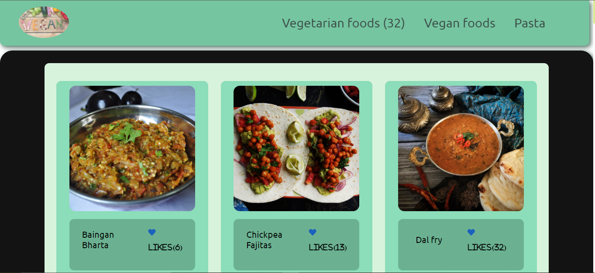

## Javascript Capstone Project

> It is a JavaScript capstone project. In this project we worked on the meal database API. 

## Screenshot

## Video Presentation

[Click on the link to see the presentation](https://drive.google.com/file/d/1Be5vMB7OQKVu-Azob_D1B5szfW1LVFqf/view?usp=sharing)

## Live Demo

<!-- [Live Demo Link](https://micky373.github.io/JavaScript_Capstone/dist/) -->
**Will be available after merge**

## Clone and review it

Run the following commands to clone and run it.

### To clone the repository

  `https://github.com/Micky373/JavaScript_Capstone.git`

### To enter Directory

`cd JavaScript_Capstone`

### To Install Packages

`npm install`

### To run project on local server

`npm start`

### To run project tests

`npm test`

### To open project with vs code 

`code .`

## Built With

- HTML
- CSS
- JavaScript
- Webpack
- Jest
- Base and Involement APIs'

## Authors

👤 **Michael Tamirie**

- GitHub: [Michael_Tamirie](https://github.com/Micky373)
- LinkedIn: [Michael_Tamirie](https://www.linkedin.com/in/michael-tamirie-288a331ab/)

👤 **Mohamed Eldeeb**

- GitHub: [mohamed eldeeb](https://github.com/eng-mohamed-eldeeb)
- Twitter: [mohamed eldeeb](https://twitter.com/eldeeb_3o)
- LinkedIn: [mohamed eldeeb](https://www.linkedin.com/in/mohamed-eldeeb-a69022206/)

## Show your support

Give a ⭐ if you like this project!
